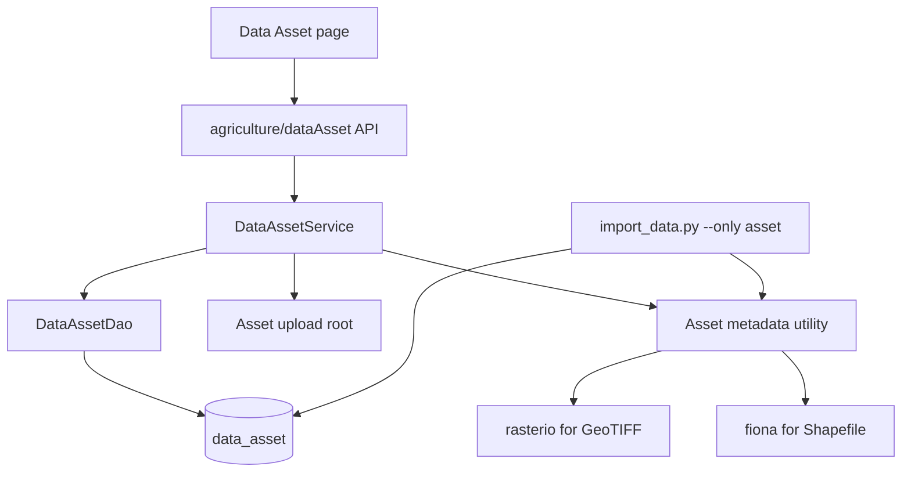
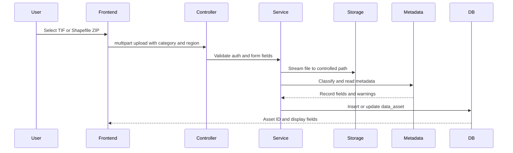
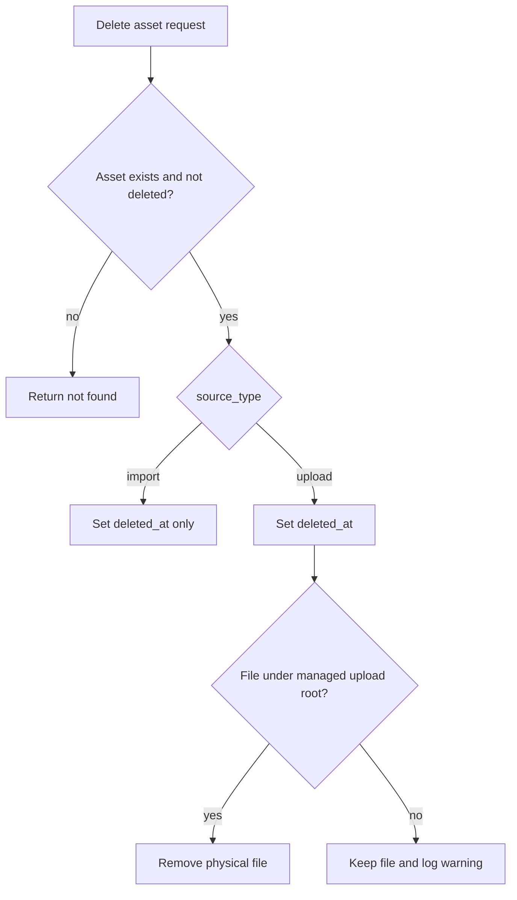

# feat: Add data asset file management

## Summary

Add a data asset management module for non-tabular agriculture files so users can upload, list, download, and delete GeoTIFF and Shapefile assets without storing file contents row-by-row in PostgreSQL. The plan keeps original files on disk and uses `data_asset` as the metadata and path index.

---

## Problem Frame

The project already imports table-shaped agriculture data into domain tables and indexes non-tabular files such as TIF and SHP in `data_asset`. Users now need an application module that manages those file assets directly: upload new files, see the file name and path, download assets, and remove unwanted entries. The implementation must protect large scientific source files from accidental loss, avoid unsafe path handling, and fit the existing RuoYi/FastAPI/Vue agriculture module patterns.

---

## Requirements

- R1. Users can view a paginated asset list with file name, relative path, asset type, file format, category, region, size, and timestamps.
- R2. Users can filter assets by file name, relative path, asset type, file format, data category, region, variable name, and observation date range.
- R3. Users can upload `.tif` and `.tiff` files as raster assets and store spatial metadata when `rasterio` can read it.
- R4. Users can upload Shapefile data as a `.zip` bundle containing a `.shp` main file and expected sidecar files, then store vector metadata when `fiona` can read it.
- R5. Users can download an asset by database ID, with the server resolving the file path from `data_asset` instead of trusting client-supplied paths.
- R6. Users can delete one or more assets from the management page, with import-sourced assets soft-deleted by default and upload-sourced physical files removed only by the backend's controlled policy.
- R7. The module uses the existing authentication, menu, permission, and agriculture page conventions.
- R8. The import script and upload workflow share one metadata classification path so future file-type support does not fork into two incompatible implementations.
- R9. The module rejects unsupported file types, unsafe filenames, path traversal, missing files, malformed Shapefile bundles, and duplicate storage collisions with actionable errors.
- R10. Existing table imports, irrigation prediction uploads, and common upload behavior remain unchanged.

---

## Scope Boundaries

### In Scope

- Manage `data_asset` records and files through a new agriculture menu page.
- Support GeoTIFF uploads as single files.
- Support Shapefile uploads as zip bundles, with sidecar files represented in `extra_metadata`.
- Display file name and path directly in the table.
- Add backend tests for metadata extraction, upload validation, download path safety, and delete policy.

### Deferred to Follow-Up Work

- Map preview, raster tile service, spatial query, and PostGIS geometry ingestion.
- Bulk folder upload from the browser.
- Fine-grained per-region ACLs beyond current menu/button permissions.
- Frontend unit tests, unless a frontend test runner is introduced separately.
- Background virus scanning or asynchronous processing queues for very large uploads.

### Out of Scope

- Replacing the existing table import pipeline.
- Changing the irrigation prediction API, which accepts TIF files for inference and returns a ZIP but does not manage persistent assets.
- Storing TIF pixels or Shapefile features row-by-row in PostgreSQL.

---

## Key Technical Decisions

- KTD1. Reuse `data_asset` as the source of truth: it already models raster/vector/file metadata and has a unique `relative_path`, so creating a parallel file table would split search and import behavior.
- KTD2. Add management fields instead of replacing the schema: `original_filename`, `storage_path`, `checksum`, `upload_user_id`, `source_type`, and `deleted_at` preserve existing import records while enabling user uploads and soft delete.
- KTD3. Store files under a dedicated asset upload root, not the generic `/common/upload` path: `UploadConfig.DEFAULT_ALLOWED_EXTENSION` does not include TIF/SHP, and scientific assets need different validation and deletion rules.
- KTD4. Download by asset ID only: the client should never provide an arbitrary filesystem path for download because the path is a trust boundary.
- KTD5. Treat imported data and user-uploaded data differently: imported assets are index records over curated source data, while uploaded assets are application-managed files.
- KTD6. Extract asset metadata helpers from `scripts/import_data.py`: import-time indexing and upload-time registration should classify files the same way.
- KTD7. Keep Shapefile as a bundle: accepting raw `.shp` alone creates unusable records when `.dbf`, `.shx`, or `.prj` is missing.
- KTD8. Start with list-level UX, not spatial preview: the user asked to show file name and path, and preview requires a larger map/tile architecture.

---

## High-Level Technical Design

---

## Implementation Units

### U1. Data asset schema and model alignment

- **Goal:** Make `data_asset` support application-managed uploads without breaking existing imported records.
- **Requirements:** R1, R2, R5, R6, R8.
- **Dependencies:** None.
- **Files:**
  - `scripts/datahub_database.sql`
  - `scripts/import_data.py`
  - `ruoyi-fastapi-backend/module_agriculture/entity/do/data_asset_do.py`
  - `ruoyi-fastapi-backend/module_agriculture/entity/vo/data_asset_vo.py`
  - `ruoyi-fastapi-backend/tests/module_agriculture/test_data_asset_models.py`
- **Approach:** Extend the SQL definition for `data_asset` with upload management columns and indexes for `source_type`, `deleted_at`, and `checksum`. Add SQLAlchemy and Pydantic models using the same naming and camel-case alias conventions as `station_do.py` and `station_vo.py`. Keep nullable defaults for new fields so existing import records remain valid.
- **Patterns to follow:** `module_agriculture/entity/do/station_do.py`, `module_agriculture/entity/vo/station_vo.py`, and the current `data_asset` SQL block in `scripts/datahub_database.sql`.
- **Test scenarios:**
  - Create a `DataAssetModel` from a mock ORM-like object with snake_case attributes and verify camel-case serialization includes `relativePath`, `fileFormat`, `sourceType`, and `deletedAt`.
  - Instantiate the model with only existing import-era fields and verify new upload fields can be omitted.
  - Verify list query fields accept asset type, category, region, variable name, file format, file name, and date range filters.
- **Verification:** The schema definition remains backward compatible, the Pydantic model can represent old and new rows, and no existing agriculture model imports are changed.

### U2. Shared asset metadata utility

- **Goal:** Move file classification and metadata extraction into a reusable backend utility used by both import and upload flows.
- **Requirements:** R3, R4, R8, R9.
- **Dependencies:** U1.
- **Files:**
  - `ruoyi-fastapi-backend/utils/data_asset_util.py`
  - `scripts/import_data.py`
  - `ruoyi-fastapi-backend/tests/utils/test_data_asset_util.py`
- **Approach:** Extract the core logic now embedded in `scripts/import_data.py`: extension sets, path normalization, category/region inference, weather raster filename parsing, raster metadata extraction, and vector sidecar discovery. Keep script-specific database upsert code in `scripts/import_data.py`; only shared classification and metadata reading move to the utility.
- **Technical design:** Directional helper boundary:
  - classify a path relative to a chosen data root;
  - read raster metadata from a file path;
  - read vector metadata from a `.shp` path;
  - validate and unpack Shapefile zip bundles into a safe temporary directory;
  - return a plain dictionary shaped for `data_asset`.
- **Patterns to follow:** `scripts/import_data.py` functions `classify_asset_path`, `read_raster_metadata`, `read_vector_metadata`, and `build_asset_record`.
- **Test scenarios:**
  - Classify `气象数据/浓江农场/RAIN_2024-07-01.tif` as raster, category `气象数据`, region `浓江农场`, variable `RAIN`, and observation date `2024-07-01`.
  - Classify DEM and land-use filenames into `DEM` and `土地利用` variables.
  - Read a tiny generated GeoTIFF fixture and verify CRS, bounds, dimensions, count, dtype, resolution, and nodata fields are mapped.
  - Simulate missing `rasterio` or read failure and verify the returned record contains `extra_metadata.metadata_warning` or `metadata_error` rather than raising for index-only use.
  - Validate a Shapefile zip containing one `.shp` plus sidecars and reject a zip with no `.shp`, multiple `.shp` mains, unsafe paths, or unsupported nested traversal.
- **Verification:** `scripts/import_data.py --only asset` can keep producing the same record shape through the shared utility, and upload service code does not duplicate metadata parsing.

### U3. Backend data asset DAO and service

- **Goal:** Provide list, detail, upload registration, download resolution, and delete policy behind a service boundary.
- **Requirements:** R1, R2, R3, R4, R5, R6, R9, R10.
- **Dependencies:** U1, U2.
- **Files:**
  - `ruoyi-fastapi-backend/module_agriculture/dao/data_asset_dao.py`
  - `ruoyi-fastapi-backend/module_agriculture/service/data_asset_service.py`
  - `ruoyi-fastapi-backend/tests/module_agriculture/test_data_asset_service.py`
- **Approach:** Implement DAO methods for paginated filtering, lookup by ID, upsert by `relative_path`, soft delete, and physical file path resolution. Implement service methods that stream uploads to a managed asset root, compute SHA-256 checksum, build metadata through `DataAssetUtil`, commit records transactionally, and enforce delete/download policy.
- **Technical design:** Directional service contract:
  - `list_assets(query, is_page=True)` returns `PageModel`;
  - `upload_asset(file, metadata_form, current_user)` returns a record DTO;
  - `resolve_download(asset_id)` returns an existing safe file path and download name;
  - `delete_assets(ids)` sets `deleted_at` and removes managed upload files when allowed.
- **Patterns to follow:** `StationDao`, `StationService`, `CommonService.upload_service`, and `UploadUtil.generate_file`.
- **Test scenarios:**
  - List excludes rows with `deleted_at` set and applies filename, format, category, region, variable, asset type, and date filters together.
  - Uploading a supported `.tif` writes to the managed root, computes checksum, extracts metadata, and inserts `source_type = upload`.
  - Uploading an unsupported `.exe`, a filename containing traversal, or an empty file raises a service exception and leaves no database row.
  - Uploading a duplicate checksum and relative path follows the chosen upsert rule without producing duplicate records.
  - Download resolution for an existing asset returns a path under the configured root or the known data directory; a missing physical file raises a clear service exception.
  - Delete for `source_type = import` only sets `deleted_at`; delete for `source_type = upload` sets `deleted_at` and removes the managed file if it is under the upload root.
  - Delete refuses to remove a file outside the managed upload root even if a stale row points there.
- **Verification:** The service owns all filesystem trust decisions and the DAO remains database-only.

### U4. Backend controller and response contracts

- **Goal:** Expose authenticated API endpoints for the frontend module.
- **Requirements:** R1, R2, R3, R4, R5, R6, R7, R9.
- **Dependencies:** U3.
- **Files:**
  - `ruoyi-fastapi-backend/module_agriculture/controller/data_asset_controller.py`
  - `ruoyi-fastapi-backend/tests/module_agriculture/test_data_asset_controller.py`
- **Approach:** Add an auto-registered `APIRouterPro` under `/agriculture/dataAsset` with list, detail, upload, download, and delete endpoints. Use `PreAuthDependency` at the router level, `DBSessionDependency` for database access, and `StreamingResponse` or `FileResponse` for downloads. Keep multipart upload separate from `/common/upload` because asset file validation differs.
- **Endpoint shape:**
  - `GET /agriculture/dataAsset/list`
  - `GET /agriculture/dataAsset/{asset_id}`
  - `POST /agriculture/dataAsset/upload`
  - `GET /agriculture/dataAsset/download/{asset_id}`
  - `DELETE /agriculture/dataAsset/{ids}`
- **Patterns to follow:** `station_controller.py`, `common_controller.py`, and `irrigation_controller.py` for multipart/file responses.
- **Test scenarios:**
  - Listing with query params returns the standard `PageResponseModel` shape.
  - Detail for a valid asset returns camel-case fields; missing ID returns a standard failure response.
  - Upload accepts multipart form fields for category, region, variable name, and file.
  - Download returns binary response headers with the original filename or stored filename.
  - Delete accepts comma-separated IDs and reports success when rows are soft-deleted.
  - All endpoints require authentication through the existing dependency.
- **Verification:** API names match frontend expectations and Swagger shows a coherent agriculture data asset group.

### U5. Frontend API module and data asset page

- **Goal:** Add the user-facing management page that lists assets and supports upload, download, and delete.
- **Requirements:** R1, R2, R3, R4, R5, R6, R7.
- **Dependencies:** U4.
- **Files:**
  - `ruoyi-fastapi-frontend/src/api/agriculture/dataAsset.js`
  - `ruoyi-fastapi-frontend/src/views/agriculture/dataAsset/index.vue`
  - `ruoyi-fastapi-frontend/src/assets/styles/agriculture.scss`
- **Approach:** Mirror the station management page structure: hero, search toolbar, action buttons, table, pagination, upload dialog, and delete confirmation. Add a dedicated API wrapper with blob handling for downloads. Keep the table focused on file name and relative path, with metadata columns available for scanning.
- **UX details:**
  - Filters: file name/path, asset type, file format, data category, region, variable name, date range.
  - Actions: upload, download, delete, reset filters.
  - Upload dialog: data category, region, variable name, asset type hint, file picker with `.tif,.tiff,.zip`.
  - Table: fixed-width ID/type/format/size columns, wide path column, operation column.
- **Patterns to follow:** `views/agriculture/station/index.vue`, `api/agriculture/station.js`, `utils/request.js` blob response handling, and existing `agri-page` styles.
- **Test scenarios:**
  - With a mocked list response, the table displays file name, relative path, type, format, category, region, size, and timestamps.
  - Search resets `pageNum` to 1 and sends only active filters.
  - Upload rejects unsupported extensions client-side and still relies on backend validation.
  - Successful upload closes the dialog, shows a success message, and refreshes the list.
  - Download calls the download endpoint by ID and saves the filename from response headers when present.
  - Delete confirms with the user, sends comma-separated IDs, refreshes, and respects button permission directives.
- **Verification:** `npm run build:prod` succeeds, and browser QA covers list, upload, download, delete, empty state, and error display.

### U6. Menu, permissions, and routing integration

- **Goal:** Make the module reachable through the existing agriculture menu and enforce button-level permissions in the UI.
- **Requirements:** R7.
- **Dependencies:** U5.
- **Files:**
  - `scripts/menu_insert.sql`
  - `ruoyi-fastapi-frontend/src/utils/hiddenMenus.js`
  - `ruoyi-fastapi-frontend/src/router/index.js`
- **Approach:** Add a second-level menu under `农业数据` named `数据资产`, routed to `agriculture/dataAsset/index`. Add button permissions for query, upload, download, and remove. The route should follow dynamic menu behavior, so static router changes should be minimal unless hidden menu configuration requires an allowlist update.
- **Patterns to follow:** Existing agriculture menu rows for `站点管理` and station button permissions in `scripts/menu_insert.sql`; existing `v-hasPermi` usage in `views/agriculture/station/index.vue`.
- **Test scenarios:**
  - A user with `agriculture:dataAsset:list` can see the menu and page.
  - A user without upload permission does not see the upload button.
  - A user without remove permission does not see delete controls.
  - Existing agriculture menus keep their current order and labels.
- **Verification:** Re-running the menu SQL in a fresh database exposes the new menu without colliding with existing IDs.

### U7. Documentation and operational notes

- **Goal:** Document how the data asset management flow works and how it differs from table import and irrigation prediction uploads.
- **Requirements:** R8, R10.
- **Dependencies:** U1, U2, U3, U4, U5, U6.
- **Files:**
  - `README.md`
  - `ruoyi-fastapi-backend/docs/data_asset_management.md`
  - `scripts/datahub_database.sql`
- **Approach:** Add a short README pointer and a focused backend doc covering supported file types, storage roots, delete policy, Shapefile ZIP expectations, metadata fields, and import/upload coexistence.
- **Patterns to follow:** `README.md` agriculture data import section and `ruoyi-fastapi-backend/docs/irrigation_api.md`.
- **Test scenarios:** Test expectation: none -- documentation-only change. Review should verify every documented endpoint and file type matches the implemented API.
- **Verification:** A developer can understand which files are indexed, which are physically managed, and how to recover from upload validation failures.

---

## System-Wide Impact

- **Database lifecycle:** Existing `data_asset` rows remain valid; new nullable columns add management state. Backward-compatible migrations are required for deployed databases.
- **Filesystem lifecycle:** The application now owns a subset of files under a managed asset upload root. Imported files under `data/` remain curated source assets and should not be physically deleted through normal UI actions.
- **Security boundary:** Download and delete paths cross from database records into the filesystem. Every path must be normalized and checked against allowed roots before access.
- **Large file behavior:** GeoTIFF files can be large. Upload must stream to disk, and metadata extraction should avoid reading entire rasters into memory when possible.
- **User permissions:** The module follows current menu permission conventions. Backend endpoint-level button permissions may be added later if the project adopts `UserInterfaceAuthDependency` broadly for agriculture modules.

---

## Risks and Mitigations

| Risk | Impact | Mitigation |
|---|---|---|
| Path traversal through uploaded filename or zip entries | Arbitrary file write/read | Sanitize filenames, reject absolute paths and `..`, and extract zips only into controlled temp dirs |
| Accidental deletion of curated imported datasets | Loss of source scientific data | Soft-delete imported rows and physically delete only managed upload files under the asset root |
| Shapefile zip missing sidecars | Broken vector records | Require exactly one `.shp` and capture sidecar presence in `extra_metadata`; warn or reject when required sidecars are absent |
| Large TIF upload exhausts memory | API instability | Stream chunks to disk and use metadata readers that inspect headers instead of full-array reads |
| Metadata library failure | Upload blocked for readable but unusual files | Store `metadata_error` in `extra_metadata` for index-only cases when the file is otherwise accepted |
| Duplicate file names collide | Overwritten assets | Use timestamp/UUID storage names and keep `original_filename` for display |
| Frontend assumes success for blob errors | Confusing failed downloads | Reuse existing blob JSON error handling from `utils/request.js` and surface backend messages |

---

## Acceptance Examples

- AE1. Given a user uploads `RAIN_2024-07-01.tif` under category `气象数据` and region `浓江农场`, when upload succeeds, then the list shows the original filename, a relative path, `assetType = raster`, `fileFormat = tif`, `variableName = RAIN`, and `obsDate = 2024-07-01`.
- AE2. Given a user uploads a zip with no `.shp`, when the backend validates the bundle, then upload fails with a clear Shapefile bundle error and no `data_asset` row remains.
- AE3. Given a user downloads asset ID 10, when the row points to an existing allowed path, then the response streams the file and uses the stored original filename.
- AE4. Given a user deletes an imported `data_asset` row, when deletion succeeds, then `deleted_at` is set and the original file under `data/` remains on disk.
- AE5. Given a user deletes an uploaded asset, when the stored file is under the managed upload root, then the row is soft-deleted and the physical file is removed.
- AE6. Given a user lacks `agriculture:dataAsset:remove`, when they open the page, then delete controls are not rendered.

---

## Documentation and Operational Notes

- Add an operational distinction between table imports, persistent data assets, and irrigation prediction uploads.
- Document supported v1 file types as `.tif`, `.tiff`, and Shapefile `.zip`.
- Document that imported assets may be re-indexed with `scripts/import_data.py --only asset`.
- Document that soft-deleted rows can be restored manually by clearing `deleted_at` if the file still exists.
- Document any new upload root setting and volume mount requirement for Docker deployment.

---

## Implementation Sequencing

1. Complete U1 and U2 first so database shape and metadata behavior are stable.
2. Build U3 service behavior and tests before exposing controller endpoints.
3. Add U4 API endpoints after service tests cover path safety and delete policy.
4. Build U5 frontend against the API contract.
5. Add U6 menu entries once the page route exists.
6. Finish U7 documentation after endpoint names and delete policy are final.

---

## Sources and Research

- `scripts/datahub_database.sql` defines the current `data_asset` table and indexes.
- `scripts/import_data.py` already classifies `.tif/.tiff` as raster and `.shp` as vector, and reads metadata with `rasterio` and `fiona`.
- `module_agriculture/controller/station_controller.py`, `service/station_service.py`, `dao/station_dao.py`, and `views/agriculture/station/index.vue` provide the CRUD pattern to follow.
- `module_admin/service/common_service.py` and `utils/upload_util.py` provide chunked upload and streaming file helpers, but their extension policy is not suitable for data assets.
- `common/router.py` auto-registers controller files under module `controller` directories.
- `scripts/menu_insert.sql` defines agriculture menu IDs and permission naming conventions.
